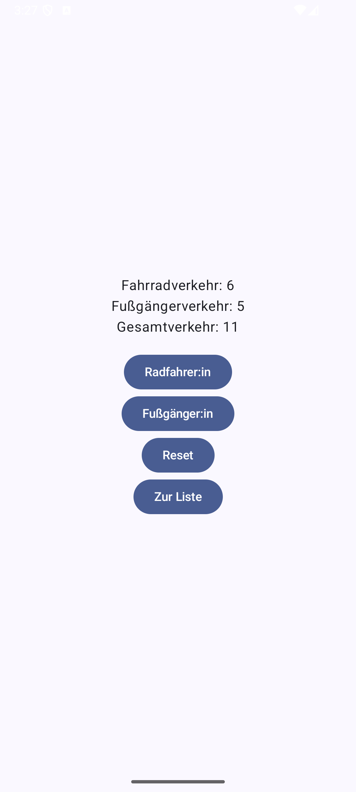
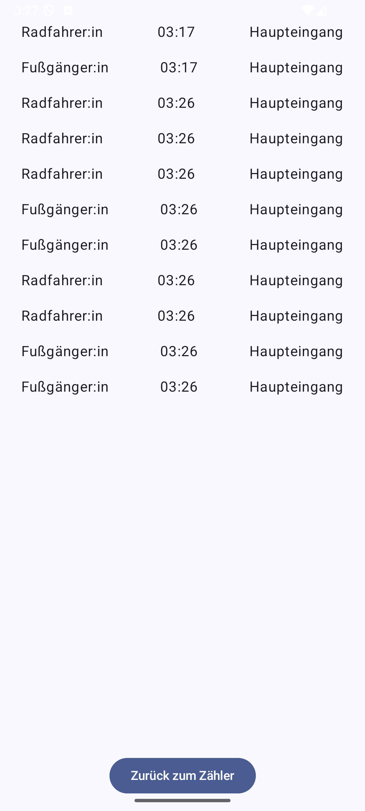

# TrafficCounter

Die **TrafficCounter**-App ist eine einfache Android-Anwendung, die den Verkehr von Fußgänger:innen und Rradfahrer:innen zählt. Die App besteht aus zwei Hauptbildschirmen:

1. **CounterScreen:**
    - Zählt die Anzahl der Fußgänger:innen und Rradfahrer:innen.
    - Zeigt die Gesamtanzahl der gezählten Personen an.
    - Ermöglicht das Zurücksetzen der Zähler.
    - Navigiert zur Liste der erfassten Daten.

2. **ListScreen:**
    - Zeigt eine Liste der erfassten Daten an, einschließlich Typ (Fußgänger:in oder Fahrradfahrer:in), Zeitstempel und Ort.
    - Ermöglicht die Navigation zurück zum CounterScreen.

---

## Funktionen

- **Zählen von Fußgänger:innen und Radfahrer:innen:**
  Über Buttons kann die Anzahl der Fußgänger:innen und Rradfahrer:innen erhöht werden.

- **Anzeige der erfassten Daten:**
  Die erfassten Daten werden in einer Liste angezeigt, die den Typ, den Zeitstempel und den Ort der Erfassung zeigt.

- **Zurücksetzen der Zähler:**
  Ein Reset-Button setzt alle Zähler und die Liste der erfassten Daten zurück.

- **Navigation zwischen den Screens:**
  Die App ermöglicht die Navigation zwischen dem CounterScreen und dem ListScreen.

---

## Technologien

- **Jetpack Compose:**
  Die Benutzeroberfläche wird mit Jetpack Compose erstellt, einem modernen UI-Toolkit für Android.

- **ViewModel:**
  Ein ViewModel wird verwendet, um die Daten zentral zu speichern und zwischen den Screens zu teilen.

- **Navigation Component:**
  Die Navigation zwischen den Screens wird mit dem Navigation Component von Jetpack implementiert.

---

## Installation und Verwendung

1. **Projekt klonen:**
   Klone das Repository auf deinen Rechner.

2. **Abhängigkeiten installieren:**
   Stelle sicher, dass alle Abhängigkeiten in der `build.gradle`-Datei installiert sind.

3. **App ausführen:**
   Öffne das Projekt in Android Studio und führe die App auf einem Emulator oder einem physischen Gerät aus.

---

## Screenshots

 

---

## Autor

Dieses Projekt wurde von Bengin Sternas erstellt.
